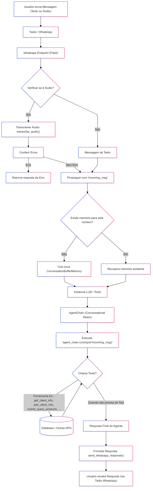

# Agente de Vendas Autônomo via WhatsApp

Este projeto consiste em um agente de vendas conversacional que interage com clientes via WhatsApp, utilizando LangChain, um LLM (Large Language Model) e ferramentas diversas para acesso a banco de dados, carrinho de compras, transcrição de áudio, entre outros.

## Sumário

- [Visão Geral](#visão-geral)
- [Funcionamento do Código](#funcionamento-do-código)
- [Tecnologias Utilizadas](#tecnologias-utilizadas)
- [Conceitos: Agents, Chains e Ferramentas (Tools)](#conceitos-agents-chains-e-ferramentas-tools)
- [Técnica de Retrieval (Recuperação da Informação)](#técnica-de-retrieval-recuperação-da-informação)
- [Configuração e Execução](#configuração-e-execução)
- [Estrutura de Diretórios](#estrutura-de-diretórios)
- [Variáveis de Ambiente](#variáveis-de-ambiente)

## Visão Geral

O agente atua como um vendedor virtual, respondendo a mensagens enviadas pelo WhatsApp. Ele pode:

- Identificar clientes pelo número de telefone e buscar seus dados no banco de dados.
- Cadastrar novos clientes se necessário.
- Buscar produtos por meio de uma consulta híbrida (semântica e léxica) a um índice vectorizado no Elasticsearch.
- Adicionar ou remover itens de um carrinho de compras mantido em memória.
- Calcular totais e apresentar uma tabela de resumo do pedido.
- Oferecer meios de pagamento e finalizar a compra.

## Funcionamento do Código

1. **Recebimento de Mensagens**: O `app.py` é o ponto de entrada. O Flask recebe as mensagens via requisições POST do Twilio.  
2. **Transcrição de Áudio**: Caso a mensagem seja um áudio, é feita a transcrição (função `transcribe_audio` em `tools/transcription_tools.py`).  
3. **Agente Conversacional**: Após ter a mensagem de texto, o `app.py` envia a entrada ao agente do LangChain, passando ferramentas que permitem acesso a banco de dados, busca de produtos e manipulação do carrinho.  
4. **Resposta ao Cliente**: O agente gera uma resposta, que é então enviada de volta ao cliente via Twilio WhatsApp.



## Tecnologias Utilizadas

- **Python 3**  
- **Flask** para o endpoint web  
- **LangChain** para a criação do agente e cadeias de raciocínio (chains)  
- **OpenAI** API para LLM e embeddings  
- **MySQL** para armazenamento de clientes e produtos  
- **Elasticsearch** + LlamaIndex para criação e consulta de índices vetoriais de produtos  
- **Twilio API** (WhatsApp) para receber e enviar mensagens  
- **Docker** (opcional) pode ser utilizado para ambiente padronizado

## Conceitos: Agents, Chains e Ferramentas (Tools)

- **LLM (Large Language Model)**: Modelo de linguagem de grande porte (ex: GPT-4), capaz de entender e gerar linguagem natural.
- **Chains (Cadeias)**: Sequências de passos executados pelo agente. Por exemplo, interpretar a pergunta do usuário, consultar ferramentas, processar dados e retornar o resultado.
- **Agents (Agentes)**: Sistemas que, recebendo uma entrada, decidem qual ferramenta usar. No caso, o agente recebe instruções, histórico e ferramentas e decide se consulta o banco de dados, o índice vetorial, o carrinho, etc.
- **Tools (Ferramentas)**: Funções auxiliares registradas no agente, como acesso ao banco de dados, cálculo de totais, busca de produtos, etc.

## Técnica de Retrieval (Recuperação da Informação)

A técnica de *retrieval* utilizada neste projeto é uma abordagem **híbrida**, combinando elementos de busca léxica (por exemplo, consulta por nome ou SKU diretamente no banco de dados) e busca semântica (utilizando embeddings em um índice vetorial no Elasticsearch).

- **Busca Léxica**: Baseia-se em palavras-chave exatas. Útil para consultas diretas por SKU ou nome de produto.
- **Busca Semântica** (via índices vetoriais): Utiliza embeddings (vetores numéricos) gerados a partir do significado do texto. Assim, mesmo que o usuário use sinônimos, contextos ou descrições pouco diretas, a busca semântica pode encontrar os produtos relevantes.

Essa abordagem híbrida garante que o agente seja robusto a diferentes tipos de consultas do cliente:  
- Consultas diretas (por SKU ou nome exato) são resolvidas facilmente via léxico.  
- Consultas mais abertas ou descritivas (ex: "preciso de um tênis para corrida") são atendidas pela busca semântica, que entende o contexto e o significado do pedido.

A importância dessa técnica está em fornecer ao usuário uma experiência mais natural e fluida, permitindo que ele consulte produtos usando linguagem natural, sem precisar conhecer detalhes exatos (como códigos ou SKUs) dos produtos.

## Configuração e Execução

1. **Instalação de Dependências**:  
   Crie um ambiente virtual (opcional) e instale as dependências:
   ```bash
   pip install -r requirements.txt
   ```


2. **Variáveis de Ambiente**:
Configure as variáveis de ambiente necessárias (```MYSQL_USER```, ```MYSQL_PASS```, ```TWILIO_SID```, ```TWILIO_TOKEN```, ```TWILIO_WHATSAPP_NUMBER```, ```OPENAI_API_KEY```, etc.).

3. **Inicialização do Servidor Flask**:

    Inicie o servidor:

    ```bash
    python app.py
    ```
4. **Integração com Twilio**:

    Ajuste o webhook do Twilio WhatsApp para apontar para o endpoint /whatsapp do seu servidor.

5. **Indexação no Elasticsearch (opcional)**:
    Rode o mysql_to_elastic.py para criar o índice vetorial no Elasticsearch a partir da base de dados MySQL:

    ```bash
    python mysql_to_elastic.py
    ```

## Variáveis de Ambiente
- ```MYSQL_USER``` e ```MYSQL_PASS```: Credenciais do MySQL
- ```TWILIO_SID```, ```TWILIO_TOKEN```, ```TWILIO_WHATSAPP_NUMBER```: Credenciais e número WhatsApp do Twilio
- ```OPENAI_API_KEY```: Chave de acesso à API da OpenAI
- ```ELASTIC_HOST```, ```ELASTIC_USER```, ```ELASTIC_PASSWORD```: Credenciais do Elasticsearch (para indexação vetorial)
